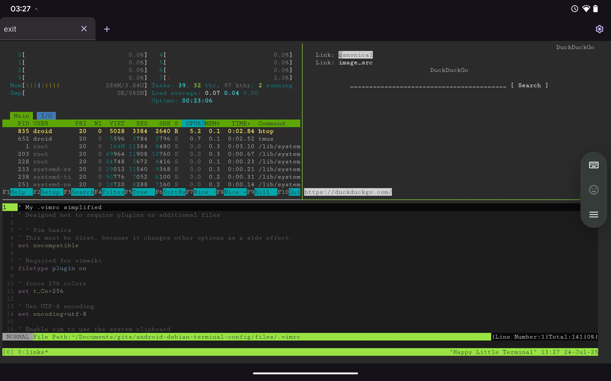
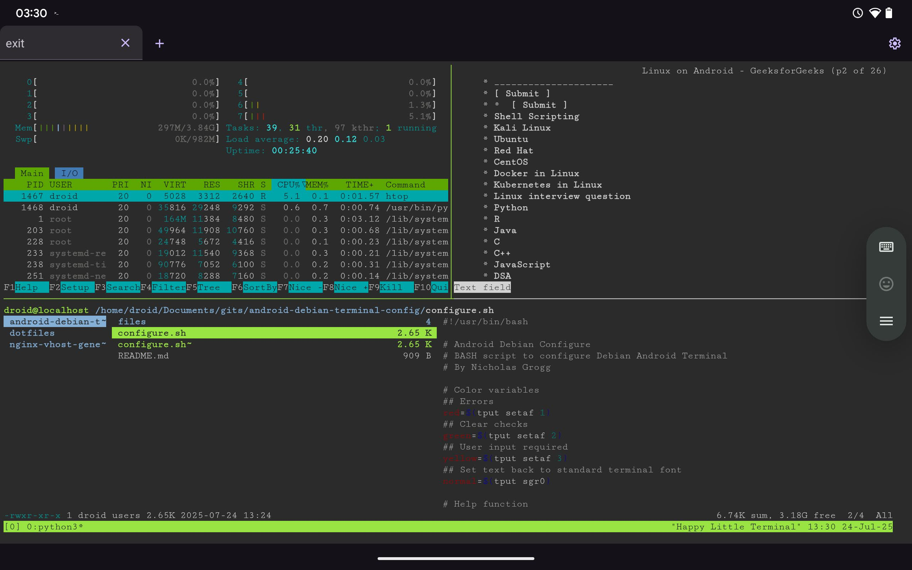

# Android Debian Terminal Config

## Overview
An attempt to create a BASH script to configure the Android Debian terminal into a development environment.

## Prerequisites
Enable the Android Terminal. Some Android devices may lack support for this feature.  
Rough process:  
1. Go to Settings -> About Phone
2. Tap the Build Number until developer mode notification is recieved.
3. Go to Settings -> System -> Developer options
4. Enable "Linux development environment"
5. Wait for download and initial setup

## Files
* **configure.sh**, BASH script to configure environment.  
  Arguments:  
  - **help/Help**, display help message and exit.
  - **configure/Configure**, install packages and download config files for minimal development environment.

## Bootstrap
To bootstrap install download the script directly and run it: 
`wget https://raw.githubusercontent.com/ngrogg/android-debian-terminal-config/refs/heads/main/configure.sh`    

Set executable bit if needed.

## Images
  
  
